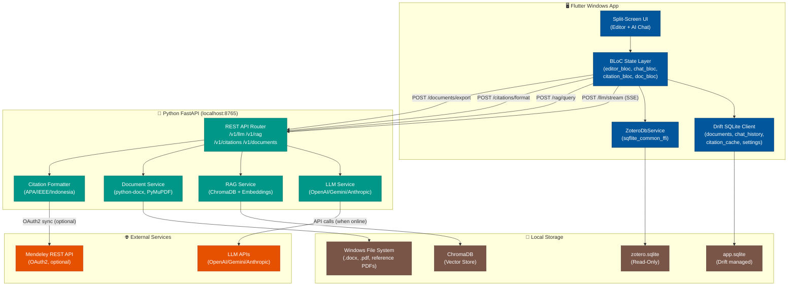

# ScriptEase App — System Architecture

## High-Level Architecture Diagram

## Component Responsibility Matrix

| Component | Technology | Responsibility | Communicates With |
|-----------|-----------|---------------|-------------------|
| Editor Canvas | flutter_quill + custom embeds | Rich text editing, citation embeds, auto-save | BLoC, Drift |
| AI Chat Panel | Flutter widgets + SSE stream | Display AI response, stream render, insert action | ChatBloc, PythonClient |
| CitationBloc | flutter_bloc | Citation search, format selection, insert trigger | ZoteroDbService, PythonClient |
| EditorBloc | flutter_bloc | Document state, Delta ops, word count | Drift, QuillController |
| Drift SQLite | drift + sqlite3_flutter_libs | Persist all app data | Flutter app |
| ZoteroDbService | sqflite_common_ffi | Read zotero.sqlite directly | zotero.sqlite |
| FastAPI Service | Python + Uvicorn | Heavy processing: PDF, RAG, LLM proxy | ChromaDB, LLM APIs |
| RAG Service | ChromaDB + sentence-transformers | Index PDFs, semantic search, context retrieval | ChromaDB |
| LLM Service | openai SDK (multi-provider) | Stream completions, token counting | External LLM APIs |
| Document Service | python-docx, PyMuPDF, WeasyPrint | Parse .docx, export .docx/.pdf | File system |
| Citation Formatter | Pure Python | Format APA/IEEE/Indonesia strings | Called by Citation API |
